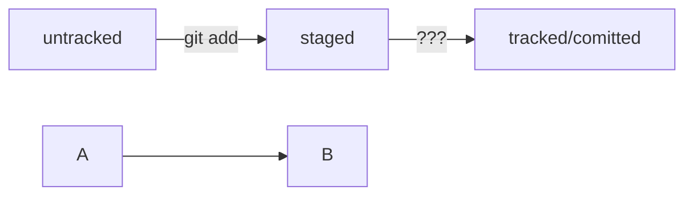

# Шпаргалка по Git

## 1. Хеш (Hash)
# Хеш - это уникальный идентификатор коммита, состоящий из 40 символов (SHA-1).
# Пример: a5acf2876b2c9e0c7f6b5e8c4f3a2b1c0d9e8f7a6
# Сокращение: хеш (обычно 7 символов) достаточно для большинства команд Git — он поймет, о каком коммите речь, если начало уникально.

## 2. Лог (Log)
# Лог - это ваш бортовой журнал. Она показывает, кто, когда и зачем вносил изменения.
# git log — показывает историю коммитов.
# git log --oneline — краткий вид.

## 3. HEAD
# HEAD — это специальный файл-указатель внутри папки .git. Он всегда «смотрит» на последний сделанный коммит в текущей ветке.
# HEAD — указатель на текущий коммит/ветку.
# Важно помнить: Когда вы создаете новый коммит, Git автоматически передвигает HEAD (и ссылку на ветку) вперед, чтобы они всегда указывали на актуальный финал истории.

## 4. Статусы файлов
# Git видит файлы не просто как «есть» или «нет», а через призму их жизненного цикла.
# Untracked (Неотслеживаемый): Файл-невидимка. Он есть в папке, но Git его игнорирует. У него нет истории.
# Tracked (Отслеживаемый): Файл, о котором Git уже знает (он либо был в коммите, либо добавлен в staged).
# Staged (Подготовленный): Файл прошел через git add и «замер» в очереди на коммит. Эту область часто называют Index или Cache.
# Modified (Измененный): Файл, который уже отслеживается, но его текущая версия отличается от той, что была зафиксирована раньше.

## 5. Стили оформления сообщений к коммитам
# Разные команды выбирают разные «уставы».
# Корпоративный (Jira-style)
# Conventional Commits
# GitHub-стиль

## 6. Схема изменения статусов файлов в Git
